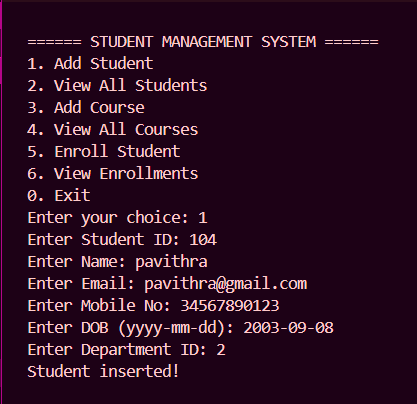
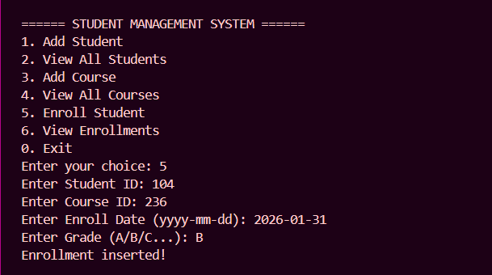

📘 Student Management System – JDBC + MySQL Project

  
 
     

📂 Project Overview

The Student Management System is a Java-based console application that demonstrates:

JDBC Connectivity

CRUD Operations

Table Relationships (FK constraints)

DAO & Utility Layer Architecture

MySQL Relational Schema

This project manages students, departments, teachers, courses, and enrollments using a normalized relational database.

🧱 Tech Stack

| Layer        | Technology                            |
| ------------ | ------------------------------------- |
| Language     | Java                                  |
| Database     | MySQL 8+                              |
| Connectivity | JDBC                                  |
| Architecture | DAO Pattern, Utility Connection Layer |
| Tools Used   | IntelliJ / VS Code / Eclipse          |

📑 Features Implemented
✔ Student Operations

Insert Student

View Students

Student–Department binding

✔ Course Operations

Add Course

Course–Teacher binding

✔ Enrollment Operations

Add Enrollment

Validates FK constraints

🧩 Database Tables Created

department

student

teacher

course

enrollment

🛠 Project Folder Structure

src/
 ├── main/
 │    └── main.java
 ├── dao/
 │    ├── studentDAO.java
 │    ├── teacherDAO.java
 │    ├── courseDAO.java
 │    └── enrollmentDAO.java
 ├── util/
 │    └── dbConnection.java
 ├── model/
 │    ├── student.java
 │    ├── teacher.java
 │    ├── course.java
 │    └── enrollment.java

🚀 How to Run the Project
1️⃣ Install & Start MySQL Server

Create a database:

CREATE DATABASE studentdb;
USE studentdb;

Run your table creation script.

2️⃣ Configure dbConnection.java
private static final String url = "jdbc:mysql://localhost:3306/studentdb";
private static final String username = "root";
private static final String password = "YOUR_PASSWORD";

3️⃣ Compile & Run the Project
javac main/main.java
java main.main

📸 Project Output Screenshots

📝 Insert Student Output

📘 Insert Course Output

📚 Insert Enrollment Output

📦 Sample Data Inserted
student

| stu_id | name     | email                                           | mobile      | dob        | department_id |
| ------ | -------- | ----------------------------------------------- | ----------- | ---------- | ------------- |
| 101    | suruthi  | [sruthi@gmail.com](mailto:sruthi@gmail.com)     | 12345678912 | 2004-05-04 | 1             |
| 102    | monisha  | [monisha@gmail.com](mailto:monisha@gmail.com)   | 2345678901  | 2004-08-09 | 2             |
| 104    | pavithra | [pavithra@gmail.com](mailto:pavithra@gmail.com) | 34567890123 | 2003-09-08 | 2             |

Teachers

| teacher_id | teacher_name | hire_date  | department_id |
| ---------- | ------------ | ---------- | ------------- |
| 101        | Dr. Kumar    | 2020-05-12 | 1             |
| 102        | Ms. Priya    | 2019-08-20 | 2             |
| 103        | Mr. John     | 2021-01-15 | 3             |

Courses

| course_id | course_name       | credits | teacher_id |
| --------- | ----------------- | ------- | ---------- |
| 234       | networks          | 3       | 102        |
| 235       | operating systems | 3       | 101        |
| 236       | big data          | 2       | 103        |

Departments

| dept_id | dept_name | location |
| ------- | --------- | -------- |
| 1       | CSE       | Block A  |
| 2       | ECE       | Block B  |
| 3       | IT        | Block C  |
| 4       | MECH      | Block D  |

Enrollments

| student_id | course_id | enroll_date | grade |
| ---------- | --------- | ----------- | ----- |
| 101        | 234       | 2026-01-01  | A     |
| 104        | 236       | 2026-01-31  | B     |

⚙ Architecture
📌 DAO Pattern Used

Each module has its own DAO performing:

insert()

update()

delete()

getAll()

This ensures clean separation between database logic and business logic.

✔ Conclusion

This project demonstrates complete JDBC + MySQL integration with a properly normalized relational schema and full CRUD operations for all entities.

You can now extend it with:

GUI using JavaFX / Swing

Authentication System

REST API (Spring Boot)

⭐ If you like this project, don’t forget to star the repository!
