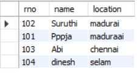
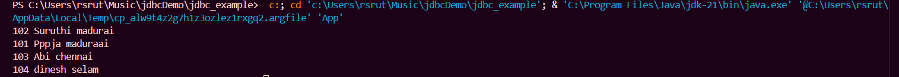

<div align="center">
  
</div>

JDBC Example – Java + MySQL


A beginner-friendly JDBC project demonstrating how to connect Java with MySQL, run SQL queries, and process results.

---

📌 Steps I Followed to Build My First JDBC Project

Below are the seven steps I personally used to build this project from scratch:

1. Step 1: Import the packages  
2. Step 2: Load and Register drive
3. Step 3: Establish connection
4. Step 4: create statement
5. Step 5: execute query
6. Step 6: process the result
7. Step 7: close the connection

---

📁 Project Structure

```
jdbc_example/
│  README.md
│  .gitattributes
│  banner.png
│
├── src/
│    └── App.java
├── lib/
│    └── mysql-connector.jar
├── bin/   (auto-generated)
└── .vscode/
```

---

🚀 How to Run

```
javac -cp lib/mysql-connector.jar src/App.java
java -cp lib/mysql-connector.jar;src App
```

---

📸 Screenshots

  
   


---
 🔮 Future Enhancements

- PreparedStatement examples  
- CRUD operations  
- Properties file for DB credentials  
